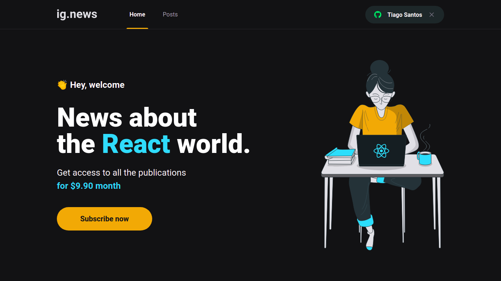
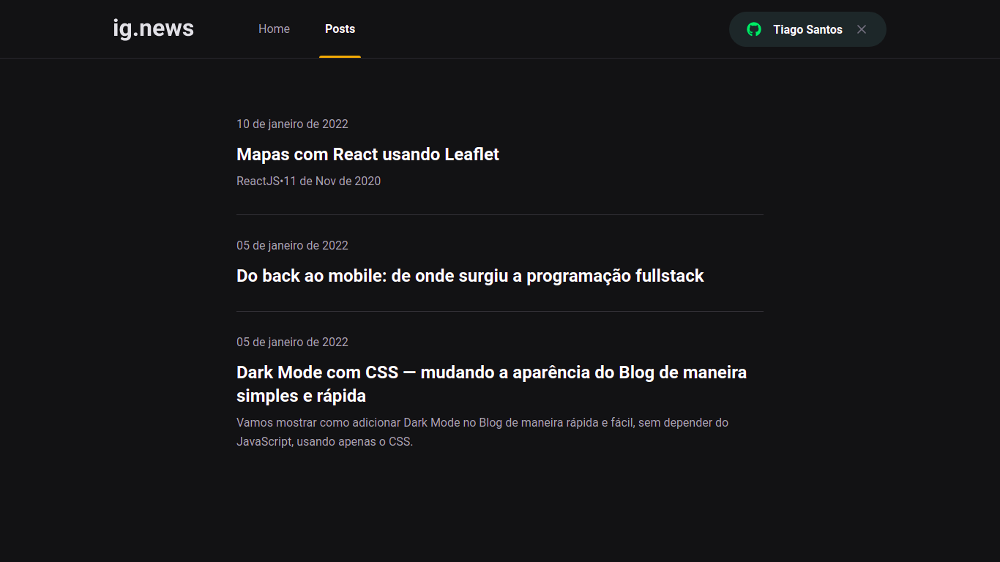

<h1 align="center">ig.news</h1>

<p align="center">
  
  
  <a href="https://github.com/jtiagosantos/ig.news/commits/master">
    
  </a>
  
   <a href="https://github.com/jtiagosantos/ig.news/stargazers">
    
  </a>
</p>

<h4 align="center"> 
	🚧  ig.news ⚛️ Completed 🚀 🚧
</h4>

<p align="center">
  <a href="#-features">Features</a> •
  <a href="#-run-project">Run Project</a> • 
  <a href="#-technologies">Technologies</a> • 
  <a href="#-layout">Layout</a> •
  <a href="#-deploy">Deploy</a> •
  <a href="#-author">Author</a> • 
  <a href="#-license">License</a>
</p>

<br>

<h1 align="center">
    
</h1>

<h1 align="center">
    
</h1>

<hr />

## ⚙️ Features

- [x] Read posts
- [x] Sign In with Github OAuth
- [x] Subscription system 
- [x] Payment with stripe

<hr>

## 🚀 Run Project

1️⃣ Clone project and access its folder:

```bash
$ git clone https://github.com/jtiagosantos/ig.news.git
$ cd ig.news
```

2️⃣ Install dependencies:

```bash
$ yarn ou npm i
```

3️⃣ Add environment variables:

```bash
#Stripe
STRIPE_API_KEY= xxxxxxxxxxxxx
NEXT_PUBLIC_STRIPE_PUBLIC_KEY= xxxxxxxxxxxxx
STRIPE_PRICE_API_ID= xxxxxxxxxxxxx
STRIPE_WEBHOOK_SECRET= xxxxxxxxxxxxx
STRIPE_SUCCESS_URL= xxxxxxxxxxxxx
STRIPE_CANCEL_URL= xxxxxxxxxxxxx

#Github
GITHUB_CLIENT_ID= xxxxxxxxxxxxx
GITHUB_CLIENT_SECRET= xxxxxxxxxxxxx

#FaunaDB
FAUNADB_KEY= xxxxxxxxxxxxx

#Prismic CMS
PRISMIC_ENDPOINT= xxxxxxxxxxxxx
PRISMIC_ACCESS_TOKEN= xxxxxxxxxxxxx
```

4️⃣ Start project:

```bash
$ yarn dev ou npm run dev
```
<hr>

## 🛠 Technologies

The following tools were used in the construction of project:

- **[Next.js](https://nextjs.org/)**
- **[Typescript](https://www.typescriptlang.org/)**
- **[Sass](https://sass-lang.com/)**
- **[Axios](https://axios-http.com/docs/api_intro)**
- **[FaunaDB](https://fauna.com/)**
- **[Prismic](https://prismic.io/)**
- **[Stripe](https://stripe.com/docs)**
- **[Github OAuth](https://docs.github.com/en/developers/apps/building-oauth-apps/authorizing-oauth-apps)**

<hr>

## 🔖 Layout

You can view the project layout through the link below:

- **[Layout Web](https://www.figma.com/file/ACftOU1lQWODLAqzNYfQAp/ig.news-(Copy)?node-id=1%3A2)**

<hr>

## ☁️ Deploy

- **[Ignews](https://ig-news-seven-self.vercel.app/)**

<hr>

## 👨‍💻 Author


<strong><a href="https://github.com/jtiagosantos">Tiago Santos </a>🚀</strong>

[](https://www.linkedin.com/in/josetiagosantosdelima/)
[](mailto:tiago.santos@icomp.ufam.edu.br)

<hr>

## 📝 License

This project is under license [MIT](./LICENSE).
